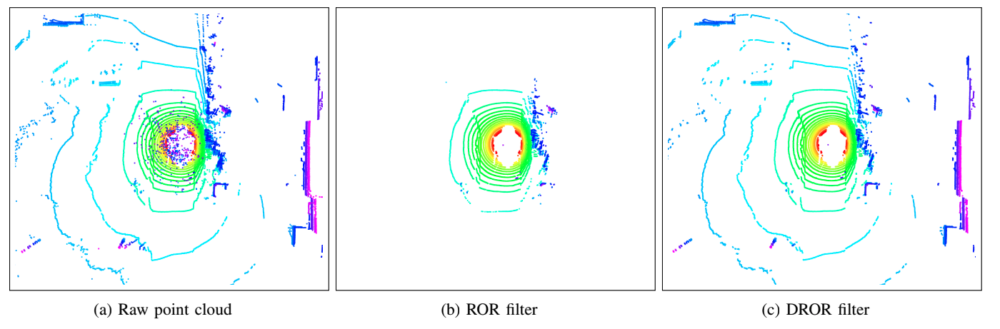

# Dynamic Radius Outlier Removal | DROR



This repo is a set of nodes for ROS to filter point clouds with the goal of removing snow in Lidar data.

To use this code, simply change the topics in the launch files to your scan topics, then play your bags and launch the appropriate launch files.

Please view the results videos on [youtube](https://www.youtube.com/channel/UC3FoqSLn12-dKOQ1Sn0xbFQ/)

***NOTE***

This package used to rely on my custom fork of pcl which had the filter implementation for PointCloud2 data type. This is now all self-contained in this repo. However, the DROR filter only works with pcl::PointCloud\<pcl::PointXYZI\> data type. The ROS node converts the scans to this format before filtering then converts back to ROS msg.

**DATASETS**

A lot of people have asked about getting access to the datasets used for this work, please see: http://cadcd.uwaterloo.ca/

**Citation**

If you found this work useful, please consider leaving a star ⭐ on this repository and citing [our paper](https://ieeexplore.ieee.org/abstract/document/8575761):

```bibtex
@inproceedings{charron2018noising,
  title={De-noising of lidar point clouds corrupted by snowfall},
  author={Charron, Nicholas and Phillips, Stephen and Waslander, Steven L},
  booktitle={2018 15th Conference on Computer and Robot Vision (CRV)},
  pages={254--261},
  year={2018},
  organization={IEEE}
}
```
